# Aplikasi Web HTMLy
<h1 align="center"></h1>

[Sekilas Tentang](#sekilas-tentang) | [Instalasi](#instalasi) | [Konfigurasi](#konfigurasi) | [Otomatisasi](#otomatisasi) | [Maintenance](#maintenance) | [Cara Pemakaian](#cara-pemakaian) | [Pembahasan](#pembahasan) | [Referensi](#referensi)
:---:|:---:|:---:|:---:|:---:|:---:|:---:|:---:

# Aplikasi Web HTMLy


## Sekilas Tentang HTMly

HTMLy merupakan open source *Databaseless* Blogging platform yang mengutamakan kesederhanaan dan kecepatan dibangun dengan bahasa pemrograman php.

HTMLy menggunakan algoritma unik untuk menemukan atau daftar isi situs berdasarkan tanggal, jenis, kategori, tag, atau penulis, dan kinerja akan tetap cepat bahkan jika kita memiliki ribuan posting dan ratusan tag.

HTMLy dirancang untuk berjalan lancar meskipun menggunakan spesifikasi server minimal. Dengan 512MB RAM atau bahkan kurang masih tetap dapat menangani lebih dari 10K posting tanpa masalah apapun.


## Instalasi

### HTMLy membutuhkan:
	- php versi >= 5.3
	- php-xml package
	- Web Server(apache2).

### Instalasi LAMP (Linux Apache MySQL PHP)
1.Instal SSH (untuk remote)
```bash
$ sudo apt update
$ sudo apt install ssh
```
2.Install Apache, MySQL, PHP; disini sebenarnya kita hanya menggunakan PHP, apache dan php-xml package saja karena hmtly tidak menggunakan database.

```bash
$ sudo apt install apache2
$ sudo apt install mysql-server
$ sudo apt install php
$ sudo apt install libapache2-mod-php
$ sudo apt install php-mysql
$ sudo apt install php-gd php-mcrypt php-mbstring php-xml php-ssh2
$ sudo service apache2 restart
```
Cek apakah instalasi apache berhasil atau tidak di http://localhost:8888 (localhost atau alamat IP)
***

### Instalasi Aplikasi HTMLy
1.Ubah status menjadi superuser agar mendapatkan permission yang penuh.
```bash
$ sudo su
```
2.Masuk ke directory /var/www/html pada host.
```bash
$ cd /var/www/html
```
3.Lakukan cloning repository htmly dari github
```bash
$ git clone "https://github.com/danpros/htmly"
```
4.Masuk ke directory htmly
```bash
$ cd htmly
```
5.Kemudian donwload juga file installer.php
```bash
$ wget "https://github.com/danpros/htmly/releases/download/v2.7.4/installer.php"
```
6.Ubah kepemilikan ke user www-data (webserver)
```bash
$ sudo chown -R www-data:www-data /var/www/html/htmly
```
7.Buka halaman http://localhost:8888/htmly/installer.php untuk instalasi lebih lanjut.
***
jika pada saat membuka 		http://localhost:8888/htmly/installer.php terdapat ***error***: no permission to write in the Directory serta ***Warning***:Your rewriteRule is not ready to use. Help!. 	lakukan langkah berikut:
### Set Up mod_rewrite for Apache
1.Enabling mod_rewrite
```bash
$ sudo a2enmod rewrite
```
2.Lakukan modifikasi pada file .htacces dengan membuka file default apache configuration
```bash
$ sudo nano /etc/apache2/sites-enabled/000-default.conf
```
3.Didalam file anda akan menemukan blcok `<VirtualHost *:80>` masukkan block berikut pada line 1, kemudian save.
```bash
...
<Directory /var/www/html>
    Options Indexes FollowSymLinks MultiViews
    AllowOverride All
    Order allow,deny
    allow from all
</Directory>
...
```
4.Restart apache
```bash
$ sudo service apache2 restart
```
5.coba akses kembali http://localhost:8888/htmly/installer.php. seharusnya sudah bisa melakukan instalasi.

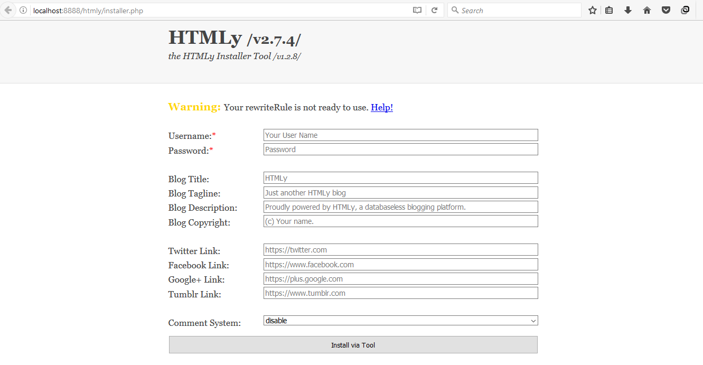

## Konfigurasi

### Pemilihan & Pergantian Tema
1. Buka laman https://www.htmly.com/download/themes
2. pilih tema web yang diinginkan. misalkan kita ingin mengganti dengan tema *cleanblog*.
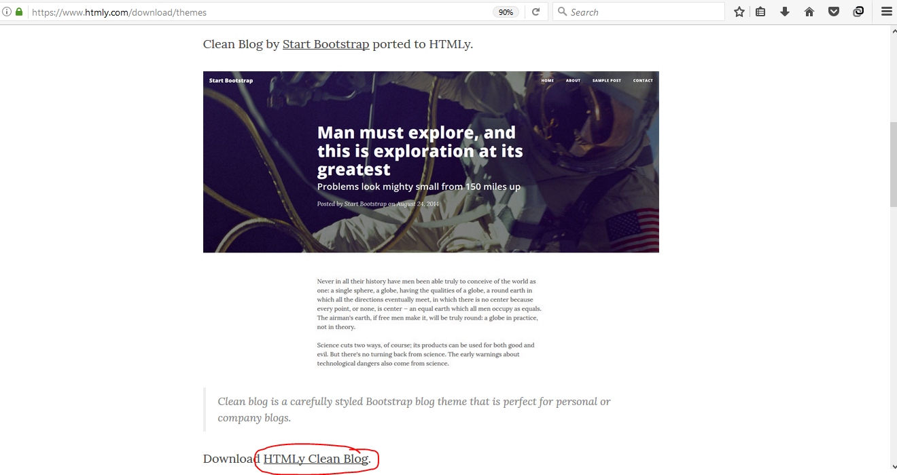
3. Download dahulu repositorinya
```bash
$ git clone "https://github.com/danpros/htmly-cleanblog"
```
4. Ganti nama foldernya menjadi ''cleanblog''
```bash
$ mv htmly-cleanblog cleanblog
```
5. Login ke aplikasi, lakukan konfigursi pada aplikasi di http://localhost:8888/htmly/admin/config. ganti `config key` dengan value `themes/cleanblog`, kemudian 'submit query'. cek menu 'home' untuk melihat perubahan.

### Third party untuk comment system (Disqus)
1. Buka laman https://disqus.com, kemudian pilih *getting started*. Lakukan sign up.
2. Kemudian pilih '*i want to comment on sites*'. setalah itu pilih menu 'blog', 'get started'
3. Isi nama website dengan 'htmly' atau apapun sesuai keinginan, secara otomatis kita akan mendapatkan *uniq disqus url* seperti di bawah ini.

4. Lakukan config pada aplikasi, ubah config key `comment.system` dengan value `disqus`. dan `disqus.shortname` dengan nama uniq disqus yang sudah dibuat pada gambar nomor 3.
5. *Submit query*, dan coba cek pada bagian *posting* apakah sudah tersedia kolom komentar atau belum.
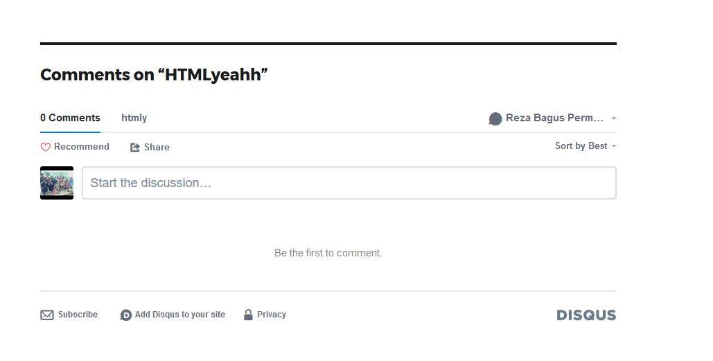


##  Maintenance

Setting tambahan untuk maintenance secara periodik, misalnya:
- hapus tmp sehari sekali --> clear cache HTmLy
- Kita dapat Menghapus cache yang ada pada website
- buat backup seminggu sekali -> ga ada
- Konfigurasi tema, pengaturan jumlah page yang tampil dan sebagainya yang terdapat di HTMLy dapat dilihat/diubah di http://localhost/htmly/admin/config; (localhost dapat berupa alamat web atau localhost).


Skrip shell untuk otomatisasi instalasi, konfigurasi, dan maintenance.
ini maksudnya yang gimana yak


## Cara Pemakaian

### Tampilan aplikasi web
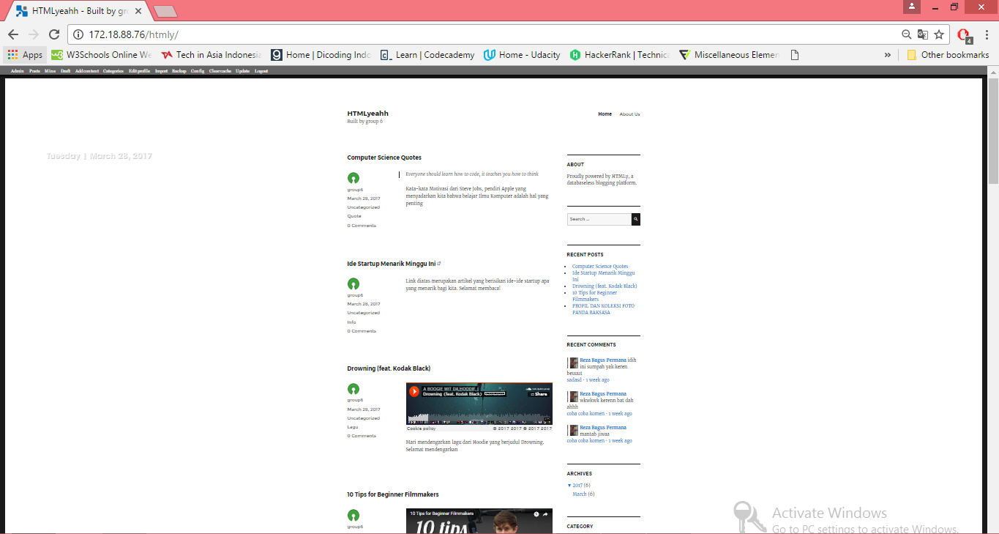
### Add Content
1. **Regular post** (Untuk postingan berisikan kata-kata saja)
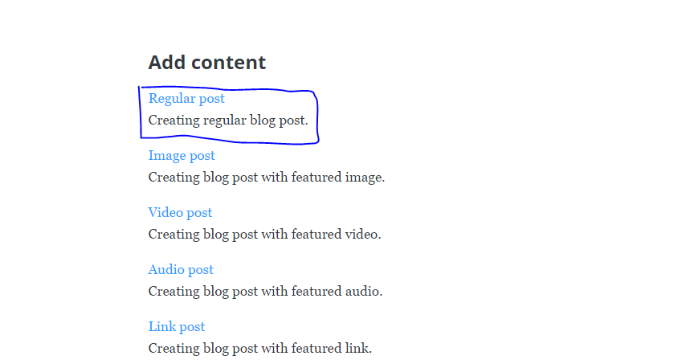
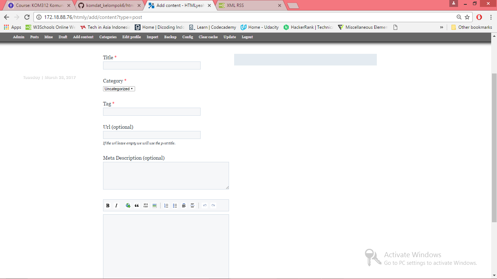
2. **Image Post** (Untuk postingan beserta feature image)
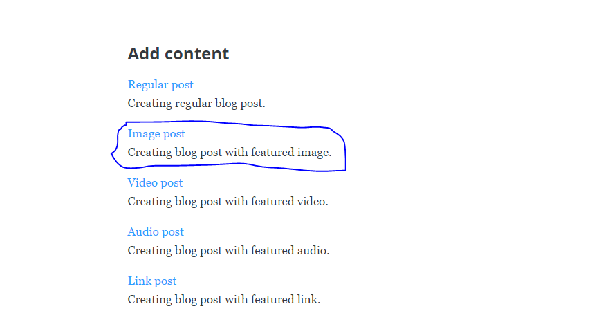
3. **Video Post** (Untuk postingan berisikan kata-kata beserta video)
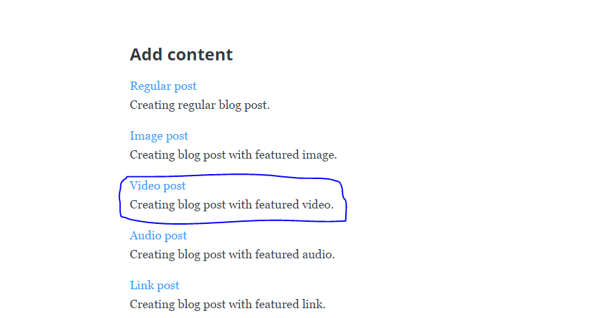
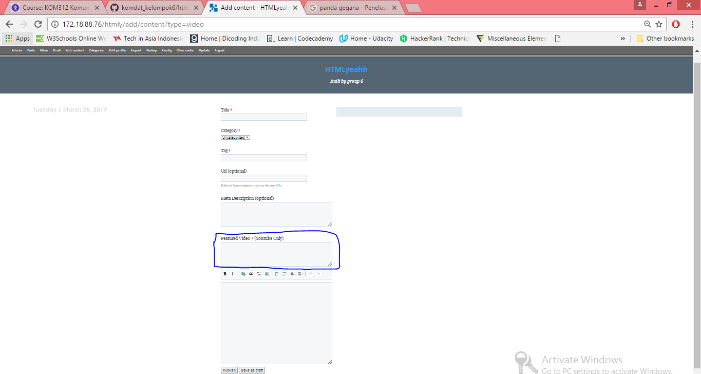
4. **Audio Post** (Untuk postingan berisikan kata-kata beserta Audio)
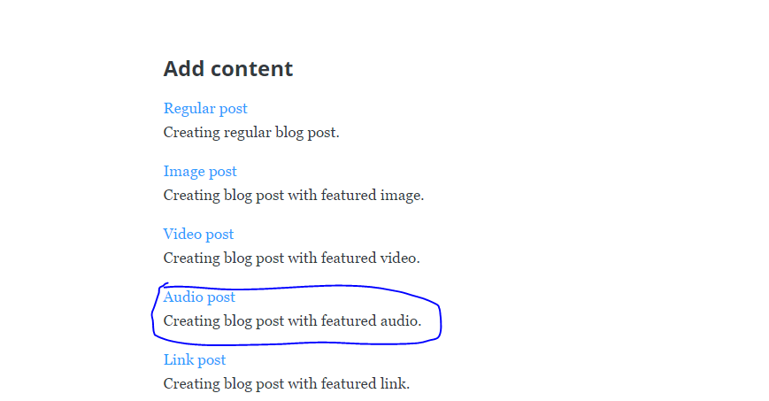
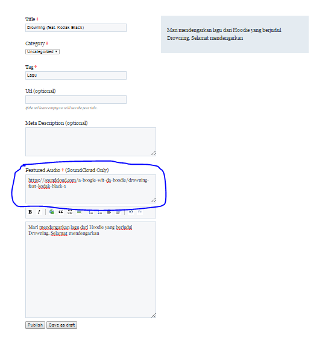
5. **Link Post** (Bisa direct ke link yang ingin dituju)
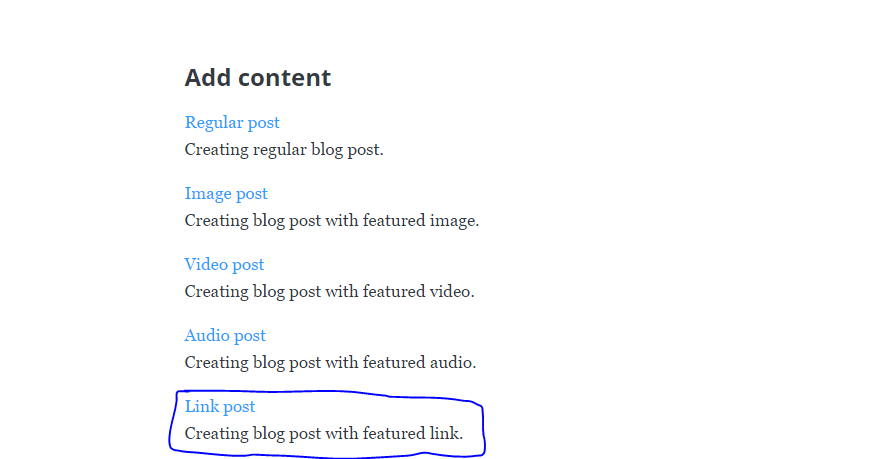
6. **Quote Post** (Postingan berisikan quotes dari seseorang)
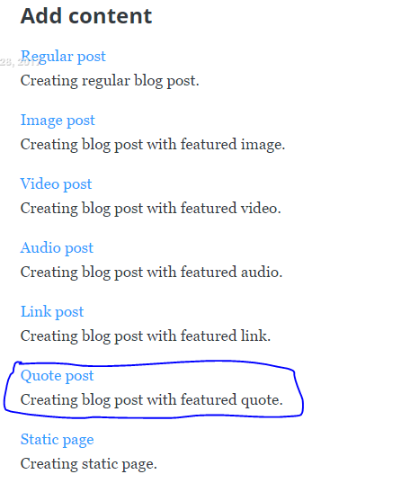
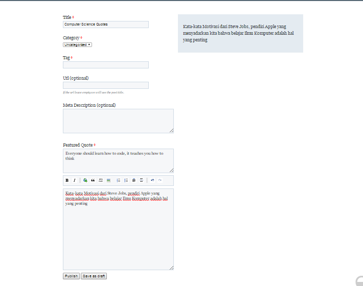
7. **Static Page**
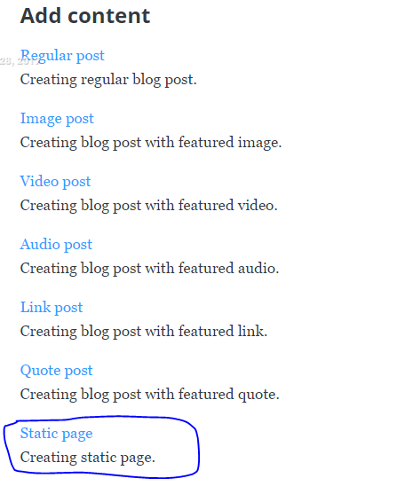
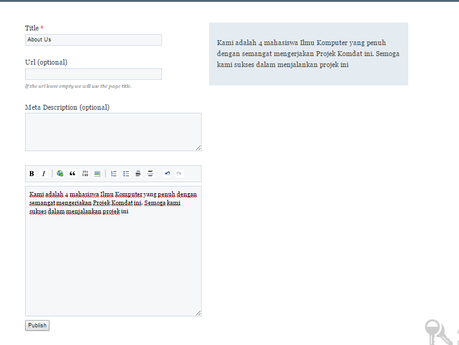

### Edit and Delete Post
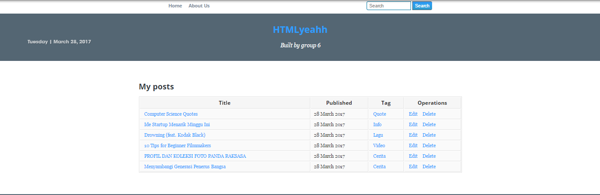

### Add Category


### Edit Profile
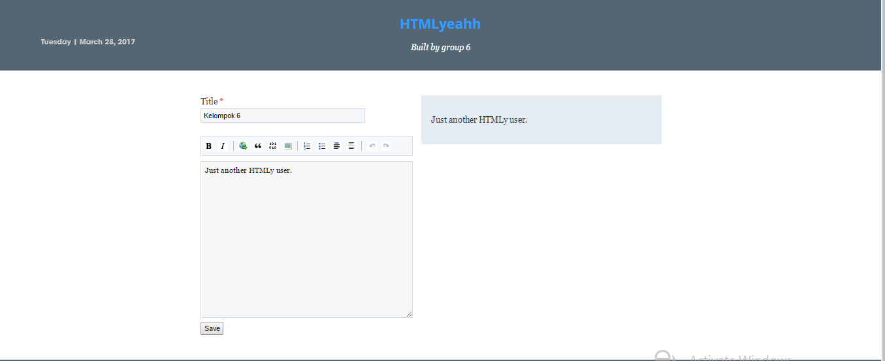

### Configuration
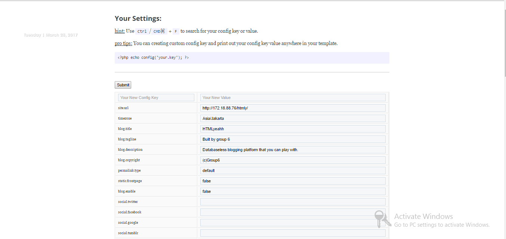

### Import
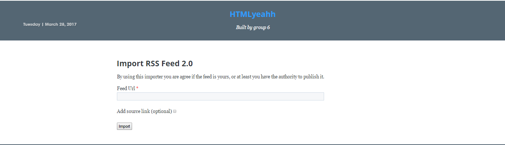


## Pembahasan
### Pendapat anda tentang aplikasi web ini

Menurut kelompok 6, HTMLy sesuai dengan pengertian yang diberikan oleh *developer*nya, yaitu cepat dan sederhana. Dengan kesederhanaan ini semua proses mem-*posting* menjadi cepat. Mengapa begitu? Karena kesederhanaannya ditonjolkan oleh *Databaseless*, dimana HTMLy adalah flat-file blog dan flat file CMS sehingga tidak ada *database* yang diperlukan. Mengapa cepat? Karena HTMLy menggunakan *File Caching* untuk meningkatkan performa secara drastis. HTMLy dapat dipakai secara gratis dan dikembangkan bersama karena *Open Resource*.

Walau punya kelebihan, menurut Kelompok 6 HTMLy memiliki kekurangan seperti berikut:

1. Tidak ada *autosave* pada saat menulis *post* baru. 
2. Tidak memiliki opsi *save as a draft*. 
3. Tidak dapat *upload* gambar dari editor.

Kelompok 6 juga melakukan pembandingan dengan kelompok yang meng-*install* Pagekit. Berikut perbandingannya:

| HTMLy | Pagekit |
|--------|--------|
|Dibangun tidak menggunakan framework| Dibangun menggunakan framework PHP Symfony dan Vue.js|
|*Databaseless* | Masih menggunakan *database*|
|*Online Backup*| Tidak *Online Backup*|
|*Cloud Update* | Tidak *Cloud Update*|
|*File Caching* | Tidak *File Caching*|
|Terdapat file manager untuk mengatur file apa saja yang diunggah ke server | Terdapat file manager untuk mengatur file apa saja yang diunggah ke server |


## Referensi

- Installation & configuration 
https://github.com/danpros/htmly

- Documentation (basic configure themes, tips & tricks)
https://docs.htmly.com/


