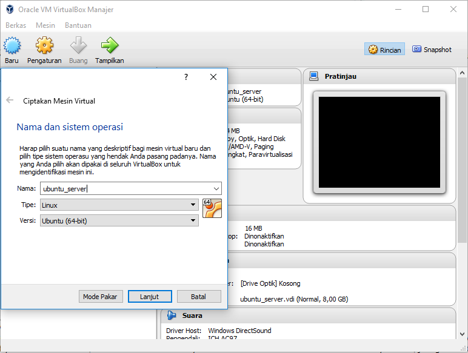

# Aplikasi Web HTMLy

## Sekilas Tentang HTMly

HTMLy merupakan open source *Databaseless* Blogging platform yang mengutamakan kesederhanaan dan kecepatan dibangun dengan bahasa pemrograman php.

HTMLy menggunakan algoritma unik untuk menemukan atau daftar isi situs berdasarkan tanggal, jenis, kategori, tag, atau penulis, dan kinerja akan tetap cepat bahkan jika kita memiliki ribuan posting dan ratusan tag.

HTMLy dirancang untuk berjalan lancar meskipun menggunakan spesifikasi server minimal. Dengan 512MB RAM atau bahkan kurang masih tetap dapat menangani lebih dari 10K posting tanpa masalah apapun.

##Instalasi

- HTMLy membutuhkan:
	- php versi >= 5.3
	- php-xml package
	- Web Server(apache2).
- Langkah instalasi dalam CLI.
###Membuat VIrtual Machine Ubuntu server 
	1.Donwload [virtual box](https://www.virtualbox.org/wiki/Downloads). kemudian install.
	2.Download Ubuntu Server.
	3.Setelah itu buka virtual box, kemudian buat baru

	4.Atur ukuran memori (langsung '*next*')
	5.Hard Disk : pilih 'buat hardisk virtual sekarang'
	6.Tipe Berkas Hardisk : pilih 'VDI (*Virtual Disk image*)'
	7.Pengaturan alokasi Memori: *Dinamik*, lanjut kemudian pilih 'buat'
	8.Jalankan  ubuntu_server yand tadi sudah dibuat, pilih file `.iso` yang tadi sudah di download, ikuti petunjuk lanjutannya [disini](http://www.tecmint.com/installation-of-ubuntu-16-04-server-edition/).

###Setting *Port-forwarding*

Name | protocol

###Instalasi LAMP (Linux Apache MySQL PHP)
	1.Instal SSH (untuk remote)
		$ sudo apt update
		$ sudo apt install ssh
    2.Install Apache, MySQL, PHP; disini sebenarnya kita hanya menggunakan PHP, apache dan php-xml package saja karena hmtly tidak menggunakan database.
    	$ sudo apt install apache2
		$ sudo apt install mysql-server
		$ sudo apt install php
		$ sudo apt install libapache2-mod-php
		$ sudo apt install php-mysql
		$ sudo apt install php-gd php-mcrypt php-mbstring php-xml php-ssh2
		$ sudo service apache2 restart
Cek apakah instalasi apache berhasil atau tidak di http://localhost:8888
#####instalasi Aplikasi HTMLy
	1.Masuk ke directory /var/www/html pada host.
		$ cd /var/www/html
    2.Lakukan cloning repository htmly dari github
    	$ git clone "https://github.com/danpros/htmly" 
    3.Masuk ke directory htmly
    	$ cd htmly
    4.Kemudian donwload juga file installer.php
    	$ wget "https://github.com/danpros/htmly/releases/download/v2.7.4/installer.php"
    5.Ubah kepemilikan ke user www-data (webserver)
    	$ sudo chown -R www-data:www-data /var/www/html/htmly
    6.Buka halaman http://localhost:8888/htmly/installer.php untuk instalasi lebih lanjut.

	jika pada saat membuka 		http://localhost:8888/htmly/installer.php terdapat ***error***: no permission to write in the Directory serta ***Warning***:Your rewriteRule is not ready to use. Help!. 	lakukan langkah berikut:
	######Set Up mod_rewrite for Apache
	1.Enabling mod_rewrite 
		$ sudo a2enmod rewrite
    2.Lakukan modifikasi pada file .htacces dengan membuka file default apache configuration
    	$ sudo nano /etc/apache2/sites-enabled/000-default.conf
    3.Didalam file anda akan menemukan blcok `<VirtualHost *:80>` masukkan block berikut pada line 1, kemudian save.
    	<Directory /var/www/html>
                Options Indexes FollowSymLinks MultiViews
                AllowOverride All
                Order allow,deny
                allow from all
		</Directory>
    4.Restart apache
    	$ sudo service apache2 restart
    5.coba akses kembali http://localhost:8888/htmly/installer.php. seharusnya sudah bisa melakukan instalasi.
## Konfigurasi (opsional)

Setting tambahan yang diperlukan untuk meningkatkan fungsi dan kinerja aplikasi, misalnya:
- batas upload file
- batas memori
- etc.
- pemilihan tema yang nice
Plugin untuk fungsi tambahan
- single log-on
- etc.
- third party untuk comment system --> disqus

##  Maintenance (opsional)

Setting tambahan untuk maintenance secara periodik, misalnya:
- hapus tmp sehari sekali
- buat backup seminggu sekali
- etc.

## Otomatisasi

Skrip shell untuk otomatisasi instalasi, konfigurasi, dan maintenance.

## Cara Pemakaian

- Tampilan aplikasi web
- Fungsi-fungsi utama
- Isi dengan data real/dummy (jangan kosongan) dan sertakan beberapa screenshot

## Pembahasan

- Pendapat anda tentang aplikasi web ini
	- pros:
	- cons:
- Bandingkan dengan aplikasi web kelompok lain yang sejenis

## Referensi

- installation & configuration 
https://github.com/danpros/htmly

- documentation (basic configure themes, tips & tricks)
https://docs.htmly.com/

